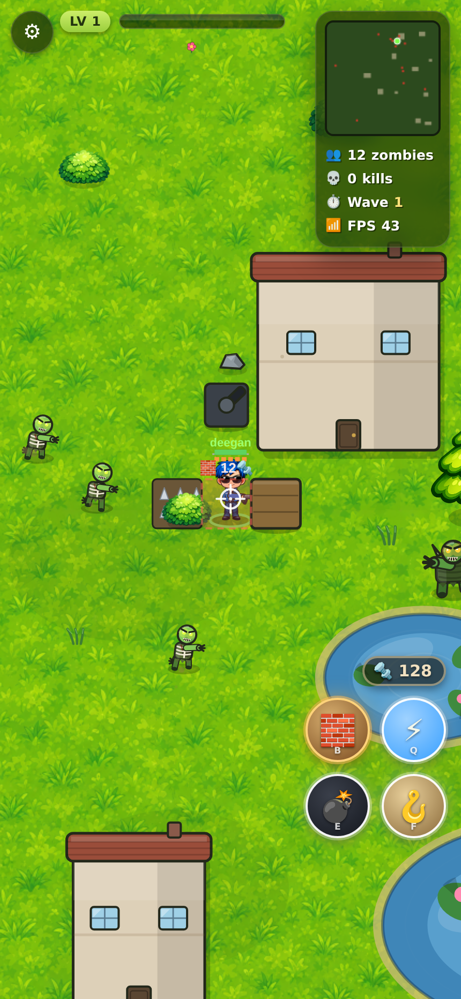
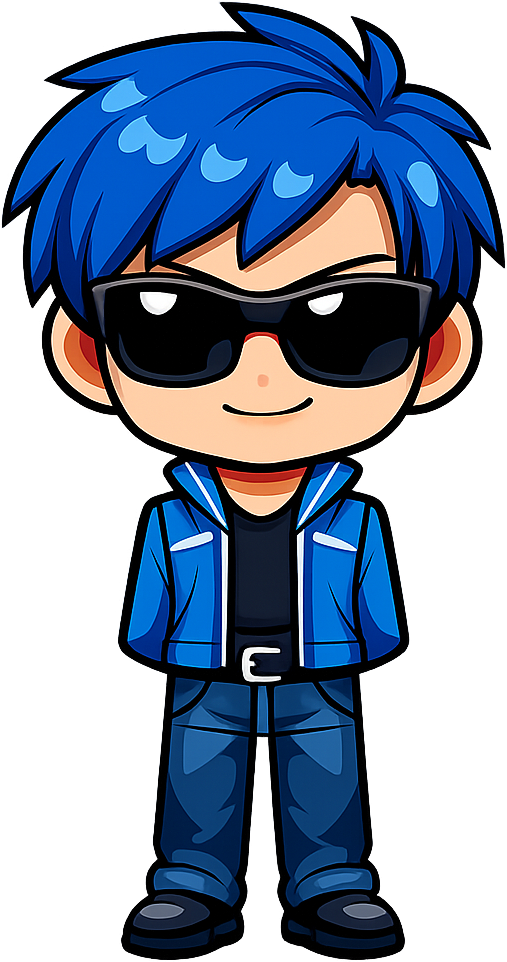
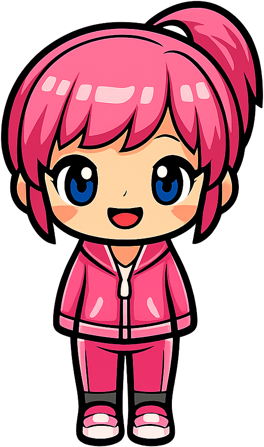
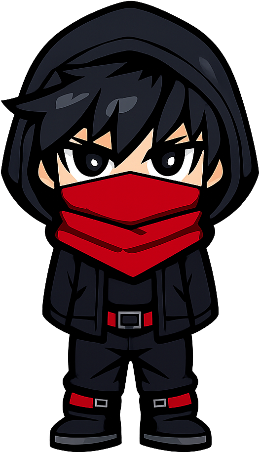
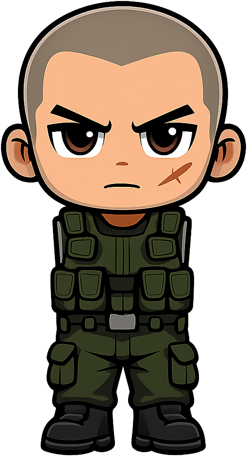
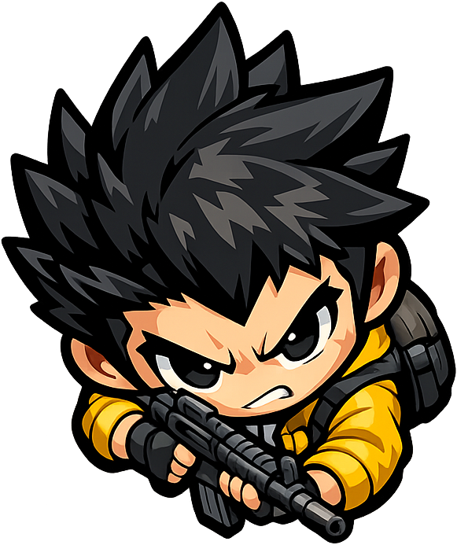
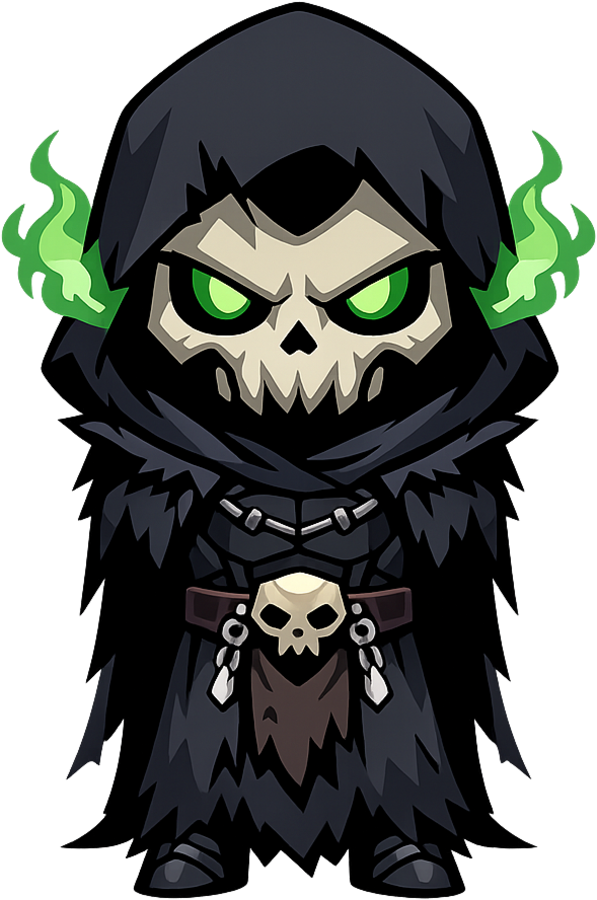

<div align="center">

# 🧟 LAST PULSE

### A portrait, mobile-first, cartoon **twin-stick survival royale** — the entire game in one `index.html`.

Pick a fighter, pick a gun, drop into a field of 15. Outlast the other players, the roaming zombies, and the closing safe zone — **scavenge scrap and build your own cover** while you're at it. **Last one standing wins.**

## ▶ &nbsp; [CLICK HERE TO PLAY](https://raw.githack.com/Deegan4/last-pulse/main/index.html) &nbsp; ◀

<sup>opens the game in your browser — no install, no sign-up · for a permanent URL see [Play](#-play)</sup>

[](https://raw.githack.com/Deegan4/last-pulse/main/index.html)
&nbsp;


<br/>


<table>
<tr>
<td align="center" width="33%"><br/><b>🧟 Endless Horde</b><br/><sub>survive escalating waves</sub></td>
<td align="center" width="33%"><br/><b>🏆 Battle Royale</b><br/><sub>outlast the shrinking zone</sub></td>
<td align="center" width="33%"><br/><b>🔨 Build &amp; defend</b><br/><sub>spend scrap on walls, spikes &amp; turrets</sub></td>
</tr>
</table>

### Meet the fighters — 15 hand-illustrated heroes, each with its own stats








<sub>…plus Milo, Chip, Yuki, Finn, Cypher, Shade, Nova, Onyx &amp; Titan — unlocked as you level up.</sub>

</div>

## ▶ Play

### ⭐ Best link — enable GitHub Pages once (2 clicks)

The repo is already Pages-ready (`index.html` at root + `.nojekyll`). This gives a fast, permanent URL that never breaks:

1. Repo **Settings → Pages**
2. **Source: Deploy from a branch** → **Branch: `main`** → **Folder: `/ (root)`** → **Save**

Then play at **`https://deegan4.github.io/last-pulse/`** — it rebuilds automatically on every push to `main`.

### Play right now (no setup)

These use free third-party proxies for the public `index.html`. If one shows a blank page or error, give it a minute (they cache briefly after a push) or try the next:

- **Latest:** <https://raw.githack.com/Deegan4/last-pulse/main/index.html>
- **Backup:** [open via htmlpreview](https://htmlpreview.github.io/?https://raw.githubusercontent.com/Deegan4/last-pulse/main/index.html)

On a laptop you can also download [`index.html`](index.html) and open it in any browser — no server, no build step, no dependencies.

## ✨ Features

- 🎮 **Twin-stick controls** — dual virtual joysticks on touch, `WASD` + mouse on desktop, plus gamepad support.
- 🏃 **Dynamic movement** — fighters accelerate with weight, lean into their run, and their stride quickens the faster they move; the camera leads the direction you're heading so the field opens up ahead of you.
- 🏆 **Three modes** — **Battle Royale** (15 players, shrinking zone), **Endless Horde** (escalating zombie waves), and **Squads** (last team standing).
- 🔨 **Build & defend** — scavenge **scrap** dropped by zombies (and scattered in caches), then spend it in-match to raise **walls** for cover, lay **spike traps**, and plant **auto-turrets** that gun down the swarm for you.
- 🧟 **Six+ zombie types** — `normal`, fast `runner`, and tanky `brute` in the mix, plus Horde horrors: acid-lobbing **Spitters**, bursting **Bloaters**, swarming **Stalkers**, and armored **Juggernaut** mini-bosses on milestone waves — all ramping in HP, speed, and damage each wave.
- 🔫 **12 weapons** — Pistol (crit), Rifle, Shotgun, SMG, Magnum, Sniper (pierce), Crossbow, Flamethrower (burn DoT), Minigun, the drum-mag Tommy, and more — each with its own ammo, reload, range, and feel.
- 🦸 **15 hand-illustrated heroes** — each with distinct speed / health stats and a live 360° gun-arm that aims and fires, gated behind your level.
- 📦 **Loot & supply drops** — health, medkits, armor, ammo, and weapon swaps, plus parachuting crates with a strong gun + armor.
- ⚡ **Power-ups** — chain-lightning, a throwable AoE bomb, and a 🪝 **grapple hook** (fire at a building, get reeled in on an elastic rope that conserves your swing momentum — release keeps your speed).
- 🩸 **Game feel** — hit markers, kill-streak callouts, ⚡ **kill combos** (chain kills for up to **3× XP** with slow-mo hit-stop), directional blood spray with ground splatter, damage-direction indicators, muzzle flash, recoil, brass casings, screen shake, a **#1 VICTORY** confetti screen, and a low-health heartbeat.
- 🌅 **Living arena** — a 3000² map with **enterable buildings** in four styles (house, shop, barn, cabin — walk in through the door, walls block bullets but doorways don't, and loot hides inside), climbable **watchtowers**, ponds, animated water, swaying trees, and day / dusk / night lighting.
- 🏘 **A world that grows with you** — leveling up adds more buildings, ponds, and greenery, and unlocks landmarks: campfires (Lv 3), fences (Lv 6), wells (Lv 10), and survivor statues (Lv 15).
- 📈 **Progression** — XP, levels, career stats (wins / matches / kills / K-D / best placement / streak), and a **"Game Updated!"** popup that shows returning players what's new.
- 🏅 **26 achievements** — tiered bronze / silver / gold badges (First Blood, Rampage, Chain Reaction, Kill Frenzy, Untouchable, Horde Master…), each paying a coin reward, tracked on a menu badge wall.
- 🪙 **Coins & shop** — earn coins from kills, wins, waves, badges, and a **daily challenge**; spend them on cosmetic particle trails.

## 🎮 Controls

| Action | Touch (mobile) | Keyboard / Mouse (desktop) |
|---|---|---|
| Move | Left stick | `WASD` / arrow keys |
| Aim & fire | Right stick (auto-fire) | Mouse aim · click or `Space` to fire |
| Reload | automatic | `R` |
| 🔨 Build (wall → spikes → turret) | 🔨 button — tap to cycle, fire to place | `B` to cycle · fire to place |
| ⚡ Lightning | ⚡ button | `Q` |
| 💣 Bomb | 💣 button | `E` |
| 🪝 Grapple | 🪝 button | `F` (again to release) |

## 🛠 Development

Everything — markup, styles, and game logic — lives in a single [`index.html`](index.html). No build system, no package manager, no dependencies.

```sh
# play / iterate: just open it
open index.html                    # or: python3 -m http.server 8000

# syntax-check both script blocks + version / asset gates (fast, no execution)
node scripts/validate.mjs
```

Want to drive it headlessly (launch, play a match, screenshot, smoke-test)? There's a ready-made skill at [`.claude/skills/run-brawl-arena/`](.claude/skills/run-brawl-arena/):

```sh
node .claude/skills/run-brawl-arena/driver.mjs --play --mode horde --shoot
```

See [CLAUDE.md](CLAUDE.md) for architecture notes, [memory.md](memory.md) for the running design log, and [ROADMAP.md](ROADMAP.md) for the future plan.

<div align="center"><sub>A from-scratch canvas remake inspired by the StickyGames title <em>Don't Die</em> — every fighter, gun, and building is original art.</sub></div>
